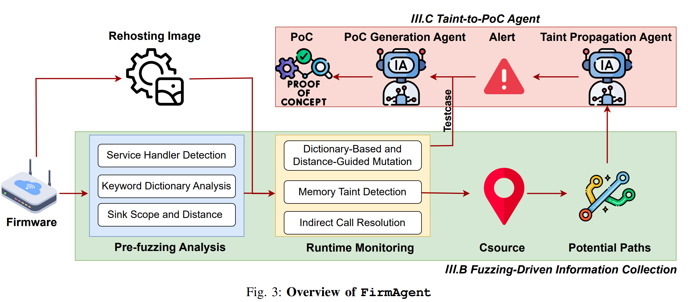

# FirmAgent

**⚠️ Legal/Ethical Notice**
Only test targets you own or have explicit written permission to assess. You are solely responsible for compliance with local laws, licenses, and organizational policies.

------

## Table of Contents

- [Overview](#overview)

- [Prerequisites](#prerequisites)

- [Quick Start](#quick-start)

- [Workflow](#workflow)

  - [1) Pre-fuzzing Analysis](#1-pre-fuzzing-analysis)
  - [2) Runtime Monitoring](#2-runtime-monitoring)
  - [3) Fuzzing](#3-fuzzing)
  - [4) Taint-to-PoC Agent](#4-taint-to-poc-agent)

- [Input/Output Schemas](#inputoutput-schemas)

  - [Pre_fuzzing.json](#pre_fuzzingjson-api-definitions)
  - [Fuzzing output files](#fuzzing-output-files)

- [Configuration Reference](#configuration-reference)

- [Tips & Best Practices](#tips--best-practices)

- [Troubleshooting](#troubleshooting)

- [FAQ](#faq)

  

------

## Overview

This toolkit automates an end-to-end workflow for discovering and validating vulnerabilities in re-hosted IoT firmware:

1. **Fuzzing-Driven Information Collection**

   - Extract all target URIs and input parameters.
   - Locate sink functions and compute distances from basic blocks to sinks.
   - Produce mutation dictionaries for the fuzzer.

   - Instrumented QEMU binaries collect control-flow data during fuzzing.
   - Optional: Build emulation images directly with a helper script.

   - Generic, device-aware API fuzzer with configurable `Host` header.
   - Uses the pre-fuzzing artifacts to generate requests and mutations.

2. **Taint-to-PoC Agent**

   - LLM-assisted taint analysis to findings vulnerabilities and produce PoCs.


------

## Prerequisites

- **Python**: 3.8+
   Install Python dependencies:

  ```
  pip install -r requirements.txt
  ```

- **Emulation**: Greenhouse (Details can be found in https://github.com/sefcom/greenhouse.git)

  - We ship instrumented binaries under `FirmAgent/FuzzingRecord/gh3fuzz/fuzz_bins/qemu/`.
  - Control-flow collector: `libibresolver.so`.

- **Target firmware**: Obtain and re-host the firmware image 

- **Setting Environment Variables:**

​	export idat64 = path/to/idat64

​	export OPENAI_API_KEY = {OPENAI_API_KEY} or export Deepseek_API_KEY  = {Deepseek_API_KEY}

------


## Quick Start

1. **Run pre-fuzzing**  **in ida** (extract inputs & sinks):

These generate:

- `Pre_fuzzing.json` (API endpoints + request templates)

2. **Build an emulated image (optional, automated wiring)**:

```
python build_fuzz_img.py
```

This integrates the instrumentation and supporting binaries into the emulation image.

3. **Start fuzzing (from the host)**:

```
python fuzzer.py \
  --base-url http://{target_ip_or_domain} \
  --json-file Pre_fuzzing.json \
  --delay 0.5 \
  --host {target_ip_or_domain}
```

4. **Run taint analysis to generate PoCs**:

```
python LLMATaint.py \
  -b {path_to_binary} \
  -p {True|False} \
  -t {vuln_type} \
  -o {path_to_resultfolder} \
  -m {model}
```

> During fuzzing, a **Source** address list and an **indirect call** JSON are produced—place these files in the **same folder as the target binary** before running `LLMATaint.py`.

------

## Workflow

### 1) Pre-fuzzing Analysis

**Goal:** Collect everything needed to drive effective mutations and triage.

- **URIs & Parameters** — `get_args.py`
   Extracts all API endpoints and “best-effort” parameter templates.
- **Sink Functions** — `Get_sinkFunc.py`
   Identifies sink function address ranges (e.g., dangerous APIs, command execs).
- **Distances** — `Distance.py`
   Computes the distances between each basic block and sink locations.
   Distances are helpful to prioritize inputs that are “closer” to sensitive sinks.

**Outputs:**

- `Pre_fuzzing.json` (API and parameter set for fuzzing)

### 2) Runtime Monitoring

We provide an instrumented QEMU stack and a control-flow recording library:

- **Location:**
   `FirmAgent/FuzzingRecord/gh3fuzz/fuzz_bins/qemu/`
  - `libibresolver.so` collects control-flow events.
- **Recommended path:**
  - Use `build_fuzz_img.py` to assemble the emulation image.
  - Instrumentation and collectors are automatically integrated.
- **Customization:**
   You can extend `qemuafl` to log additional runtime signals.
   We provide our **Fuzzing-SA** source for reference (see repo).

### 3) Fuzzing

Run the generic fuzzer against your re-hosted device:

```
python fuzzer.py \
  --base-url http://{target_ip_or_domain} \
  --json-file Pre_fuzzing.json \
  --delay 0.5 \
  --host {target_ip_or_domain}
```

- `--base-url` — Base URL for the target (scheme required).
- `--json-file` — Pre-fuzzing output containing API definitions.
- `--delay` — Inter-request sleep to avoid rate-limits / WAFs.
- `--host` — Value for the `Host` header (supports SNI / vhosts).

**What happens:**

- The fuzzer parses `Pre_fuzzing.json` and parameter templates.
- For each endpoint & parameter, it generates mutations (e.g., command-injection, XSS, traversal).
- Requests and responses are logged to `fuzzing_results.log`; structured details to `detailed_results.json`.
- Potential vulnerabilities are flagged based on error codes, timing, and content indicators.

### 4) Taint-to-PoC Agent

Once fuzzing surfaces suspicious behavior, validate and transform it into concrete PoCs:

```
python LLMATaint.py \
  -b {path_to_binary} \
  -p {True|False} \
  -t {vuln_type} \
  -o {path_to_resultfolder} \
  -m {model}
```

**Important:**
 Place the **Source addresses** file and the **indirect call JSON** produced during fuzzing into the **same directory as the target binary** before running `LLMATaint.py`. This lets the agent align runtime signals with code structures for precise taint propagation and PoC crafting.

------

## Input/Output Schemas

### Pre_fuzzing.json (API definitions)

An array of API objects. Minimal fields required by `fuzzer.py`:

```
[
  {
    "api_url": "/nitro/v1/config/example_endpoint",
    "http_method": "POST",
    "request_payload": "{ \"username\": <String_value>, \"cmd\": <String_value>, \"enabled\": true }"
  }
]
```

- `api_url`: Relative path joined with `--base-url`.
- `http_method`: `GET`, `POST`, `PUT`, `DELETE`, …
- `request_payload`: A JSON string containing placeholders:
  - `<String_value>` indicates a fuzzable string parameter.
  - Boolean literals `true/false` are supported and extracted but (by default) only string-type placeholders are fuzzed.

### Fuzzing output files

- **`fuzzing_results.log`** — Human-readable progress and warnings.
- **`detailed_results.json`** — Line-delimited JSON of each attempt:
- **`Source.json`** — source address
- **`Indirect_call.json`** — （caller, callee）

------

## Configuration Reference

`fuzzer.py` CLI:

```
--base-url    (str, required) Base URL, e.g., http://10.0.0.2
--json-file   (str, required) Path to Pre_fuzzing.json
--delay       (float, default 0.5) Seconds between requests
--host        (str, required) Host header value (IP or DNS name)
```

**Headers** (inside `send_request`):

- `Host` is set from `--host`.
- `Content-Type: application/json` by default.
- Adjust or extend headers as needed for auth, cookies, etc.

**Payload dictionary** (default built-ins):

- `buffer_overflow` – long `'A' * 60`
- `command_injection_*` – `|`, `;`, `&`, backticks, `$()` forms
- `xss_payload` – basic `<script>alert(1)</script>`
- `path_traversal` – `../../../etc/passwd`

> Extend `self.payloads` in `APIFuzzer.__init__` to add more patterns.

------

## Tips & Best Practices

- **Rate limiting / IDS**: Tune `--delay`, random jitter is already built-in between endpoints.
- **HTTPS**: If you hit certificate issues, you can allow `verify=False` (already used for non-GET). Prefer installing proper CA bundles in production assessments.
- **Virtual hosts / SNI**: Always pass `--host` when the server expects a specific `Host` header different from the IP.
- **Schema hygiene**: Keep `Pre_fuzzing.json` valid. The fuzzer does some lightweight repair, but broken JSON templates will reduce coverage.
- **Narrow scope rapidly**: Use sink distance data to prioritize endpoints closer to danger zones.
- **Artifact hygiene**: Keep fuzzing artifacts (source addresses, indirect call JSON) side-by-side with binaries before launching `LLMATaint.py`.

------

## Troubleshooting

- **`No API definitions found`**:
   Ensure `Pre_fuzzing.json` exists and is valid JSON. Run pre-fuzzing scripts again.
- **`No parameters found` for an endpoint**:
   Make sure your `request_payload` string includes `<String_value>` placeholders for fuzzable fields.
- **`Request error: ...` / timeouts**:
  - Verify network reachability from the host to the emulated firmware.
  - Increase timeouts in `send_request` if needed.
  - Check target service actually listens on the base URL.
- **Target requires auth**:
   Add cookies/headers/tokens in `send_request()` or pre-set in `para_results.json`. You can also add an `Authorization` header.
- **Instrumentation not recording**:
   Prefer using `build_fuzz_img.py`. If doing it manually, confirm your loader paths and (if applicable) `LD_PRELOAD`/QEMU plugins are active. Ensure `libibresolver.so` is discoverable by the emulated environment.
- **LLMATaint cannot find source/indirect call files**:
   Place both artifacts in the **same directory** as the target binary passed via `-b`.

------

## FAQ

**Q:** Can I fuzz by device name instead of IP?

 **A:** Yes. Pass the device DNS name to both `--base-url` (e.g., `http://device.local`) and `--host device.local`.

**Q:** How do I add new payloads (e.g., SQLi)?

 **A:** Extend `self.payloads` in `APIFuzzer.__init__`. Add detection logic (error signatures, timing, reflections) in `analyze_response()`.

**Q:** Can I parallelize fuzzing?

 **A:** The provided script is single-process to preserve ordering and throttling. You can shard `Pre_fuzzing.json` by endpoints across multiple processes/containers.

**Q:** Where do logs go?

 **A:** Human logs → `fuzzing_results.log`; structured artifacts → `detailed_results.json`.


### Example Commands Recap

**Build emulation image (optional):**

```
bash
python build_fuzz_img.py
```

**Run fuzzing (host):**

```
python fuzzer.py \
  --base-url http://10.3.16.201 \
  --json-file Pre_fuzzing.json \
  --delay 0.5 \
  --host 10.3.16.201
```

**Run taint-to-PoC agent:**

```
python LLMATaint.py \
  -b ./bin/httpd \
  -p True \
  -t ci \
  -o ./results/ASUS \
  -m R1
```


